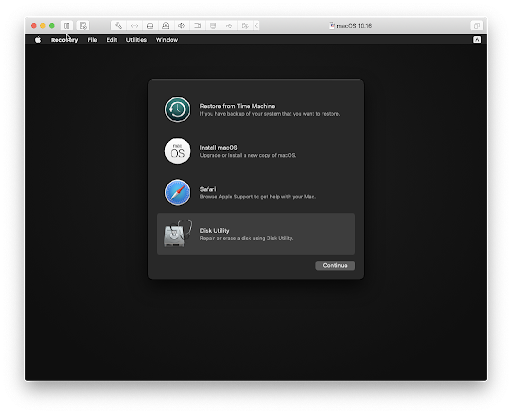
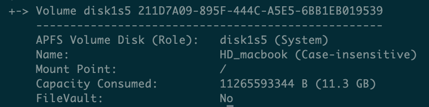

# Your macbook powers off randomly

## Symptoms

You are working and suddenly the machine powers off. The apple logo (and maybe the keyboard retro-lighting) stays on for a few secons. Then the machines powers off.

When you press the power key, the machine boots normally and no error message appears.

## What happened ?


For certain Macbooks, there is a faulty component on their logic board that force the machine into deep sleep.

Changing this component requires skill, time and money that note everyone may have.

The issue is related w


## The solution

Here is the cooking recipe for solving the problem under Big Sur:

1. Boot normally

2. Play a video in the background, for [instance this one](https://www.youtube.com/watch?v=GEZhD3J89ZE) to keep the CPU busy while we work.

3. Open a Terminal

4. Deactive FileVault as follows:
```
sudo fdesetup disable
```

And press the "Enter" key to execute the command.

> you can get you username using the command
> `whoami`
> your password is the session password

5. Now we have to wait for the hardrive to be de-encrypter. To check on the process you may run from time to time:

```
fdesetup status
```

> for those using brew, I recommend using `watch fdesetup status`

6. When the processus has reached `100` or when you will read `FileVault is Off` , we can move on.

7. Reboot into recovery mode (hold down "cmd" + "R" keys when the machine powers up)

> You should see the following screen at some point



8. On the top menu bar, goto Utilities > Terminal

9. Now we are going to turn off SIP
```
csrutil disable
csrutil authenticated-root csrutil
```

10. We are going to mount the root HDD

> If you don't know what is your root HDD, you can run :
> ```
diskutil apfs list
```

> Your root HDD is the one whose (Role) in the label *APFS Volume Disk* matches "(System)"


To mount in writing mode the HDD, use the following command and susbtitute HDD\_Name with the name for you root HDD:
```
mount -uw /Volumes/"HDD_NAME"
```

>In the previous image HDD_name was "HD\_macbook".
>To avoid issues with spaces in a name, use quotes "" around the name, for instance "HD Macbook"
>>You can also escape spaces using backslashe -> HD\ Macbook

11. Now let's move the folder "System/Library/Extensions" on the mounted drive and remove caches.
Don't forget to change HDD\_NAME for the actual name of your HDD:

```
cd /Volumes/"HDD_NAME"/System/Library/Extensions
mv AppleThunderboltNHI.kext AppleThunderboltNHI.kext.BAK
rm -rf /System/Library/Caches/*

```

12. We have to update the kext cache and select the snapshot for the next boot:
```
kmutil install -u --force --volume-root /Volumes/"HDD_NAME"/System/Library/Extensions
bless -folder /Volumes/"HDD_NAME"/System/Library/CoreServices —bootefi --create-snapshot
```

13. We will not enable SIP anymore. Enabling SIP has proven to create boot loops after modyfing operating system files.

14. You are done and can reboot in normal mode.

15. Reactivate FileVault
```
sudo fdesetup enable
```

16. If you install any OS updates, it is very likely that you will need to redo all the steps.

## Resources

- The solution for OSX Catalina can be found here:
[https://outluch.wixsite.com/rmbp-crash](https://outluch.wixsite.com/rmbp-crash)
> However the step are incomplete for Big Sur
> We can't use "sudo mount -uw" directly to modify "AppleThunderboltNHI" as in the guide because of read-only restrictions
- The reason why the system is locked in read-only can be found here:
[https://developer.apple.com/forums/thread/649832]
> It shows that it worked under Catalina but no more under Big Sur
- This reference shows the updated answer for Big Sur
[https://developer.apple.com/forums/thread/666567](https://developer.apple.com/forums/thread/666567)
> for "csrutil authenticated-root disable", FireVault on "Mackbook HD" must be turner off.
- how to turn FireVaul off was found here
[https://www.whileifblog.com/2017/07/09/macos-manage-filevault-from-command-line/](https://www.whileifblog.com/2017/07/09/macos-manage-filevault-from-command-line/)
- Another interesting read about making permanent change to the OS and issues with kmutil
[https://egpu.io/forums/mac-setup/macos-up-to-11/](https://egpu.io/forums/mac-setup/macos-up-to-11/)